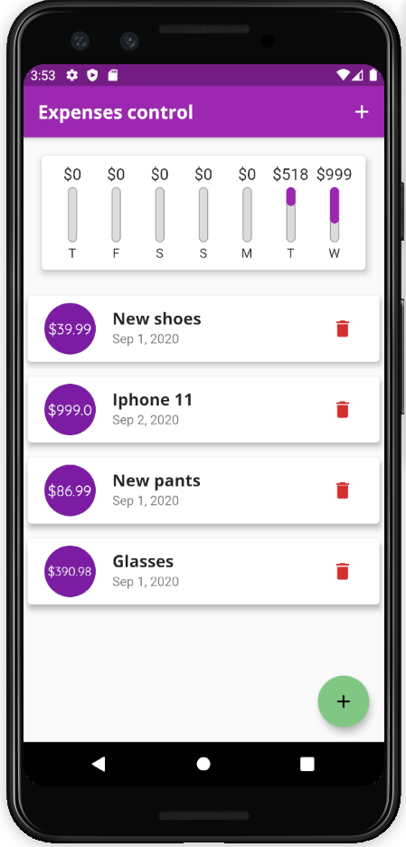

<h1 align="center">
    Personal expenses app with Flutter
</h1>

  <a href="#rocket-tecnologias">Tecnologias</a>&nbsp;&nbsp;&nbsp;|&nbsp;&nbsp;&nbsp;
  <a href="#-projeto">Projeto</a>&nbsp;&nbsp;&nbsp;

 

  

## 🚀 Tecnologias

Esse projeto foi desenvolvido com as seguintes tecnologias:
- [Flutter](https://flutter.dev/)
- [Dart](https://dart.dev/)

## 💻 Projeto

Esse projeto é apenas para testar algumas funcionalidades do Flutter que eu apredi.

